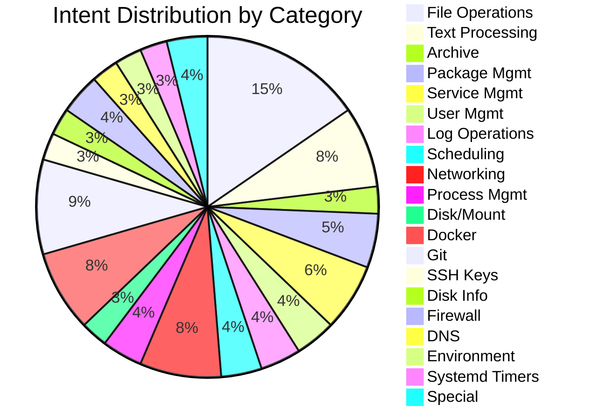
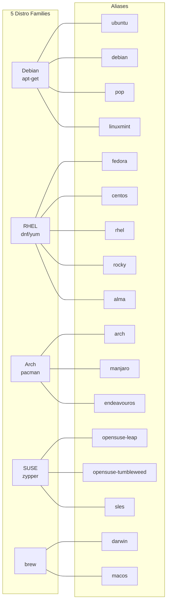

# Intent Catalog

INCEPT recognizes 75 actionable intents plus 3 special intents (78 total), organized into 18 categories. Each intent maps to a deterministic compiler that produces a validated command with distro-aware variants across 5 distro families: **Debian**, **RHEL**, **Arch**, and **SUSE**.

## File Operations (12 intents)

| Intent | Description |
|---|---|
| `find_files` | Search for files by name, type, size, or modification time |
| `copy_files` | Copy files or directories to a new location |
| `move_files` | Move or rename files and directories |
| `delete_files` | Remove files or directories |
| `change_permissions` | Modify file or directory permissions |
| `change_ownership` | Change file or directory owner/group |
| `create_directory` | Create new directories |
| `list_directory` | List contents of a directory |
| `disk_usage` | Check disk space usage |
| `view_file` | Display file contents |
| `create_symlink` | Create symbolic links |
| `compare_files` | Compare two files for differences |

## Text Processing (6 intents)

| Intent | Description |
|---|---|
| `search_text` | Search for text patterns in files |
| `replace_text` | Find and replace text in files |
| `sort_output` | Sort lines of text |
| `count_lines` | Count lines, words, or characters |
| `extract_columns` | Extract specific columns from text |
| `unique_lines` | Filter or count unique lines |

## Archive Operations (2 intents)

| Intent | Description |
|---|---|
| `compress_archive` | Create compressed archives (tar, gzip, zip) |
| `extract_archive` | Extract files from archives |

## Package Management (4 intents)

| Intent | Description | Debian | RHEL | Arch | SUSE |  |
|---|---|---|---|---|---|---|
| `install_package` | Install software packages | `apt-get install` | `dnf install` | `pacman -S` | `zypper install` | `brew install` |
| `remove_package` | Remove software packages | `apt-get remove` | `dnf remove` | `pacman -R` | `zypper remove` | `brew uninstall` |
| `update_packages` | Update installed packages | `apt-get update` | `dnf check-update` | `pacman -Sy` | `zypper refresh` | `brew update` |
| `search_package` | Search for available packages | `apt-cache search` | `dnf search` | `pacman -Ss` | `zypper search` | `brew search` |

## Service Management (5 intents)

| Intent | Description | Linux |  |
|---|---|---|---|
| `start_service` | Start a system service | `systemctl start` | `brew services start` |
| `stop_service` | Stop a system service | `systemctl stop` | `brew services stop` |
| `restart_service` | Restart a system service | `systemctl restart` | `brew services restart` |
| `enable_service` | Enable a service to start at boot | `systemctl enable` | `brew services start` |
| `service_status` | Check the status of a service | `systemctl status` | `brew services info` |

## User Management (3 intents)

| Intent | Description |
|---|---|
| `create_user` | Create a new user account |
| `delete_user` | Delete a user account |
| `modify_user` | Modify user account properties |

## Log Operations (3 intents)

| Intent | Description | Linux |  |
|---|---|---|---|
| `view_logs` | View system or application logs | `journalctl` | `log show` |
| `follow_logs` | Follow log output in real-time | `journalctl -f` | `log stream` |
| `filter_logs` | Filter logs by pattern or time range | `journalctl --grep` | `log show --predicate` |

## Scheduling (3 intents)

| Intent | Description |
|---|---|
| `schedule_cron` | Schedule a recurring task with cron |
| `list_cron` | List scheduled cron jobs |
| `remove_cron` | Remove a scheduled cron job |

## Networking (6 intents)

| Intent | Description | Linux |  |
|---|---|---|---|
| `network_info` | Display network configuration | `ip addr` | `ifconfig` |
| `test_connectivity` | Test network connectivity | `ping -W` | `ping -t` |
| `download_file` | Download a file from a URL | `curl`/`wget` | `curl`/`wget` |
| `transfer_file` | Transfer files between hosts (scp, rsync) | scp/rsync | scp/rsync |
| `ssh_connect` | Connect to a remote host via SSH | ssh | ssh |
| `port_check` | Check if a network port is open | `ss -tlnp` | `lsof -iTCP` |

## Process Management (3 intents)

| Intent | Description | Linux |  |
|---|---|---|---|
| `process_list` | List running processes | `ps aux --sort` | `ps aux \| sort -rnk` |
| `kill_process` | Terminate a process | `kill` | `kill` |
| `system_info` | Display system information | `uname`, `free`, `/proc/cpuinfo` | `uname`, `vm_stat`, `sysctl` |

## Disk / Mount (2 intents)

| Intent | Description |
|---|---|
| `mount_device` | Mount a filesystem or device |
| `unmount_device` | Unmount a filesystem or device |

## Docker (6 intents)

| Intent | Description |
|---|---|
| `docker_run` | Run a Docker container |
| `docker_ps` | List Docker containers |
| `docker_stop` | Stop a running Docker container |
| `docker_logs` | View Docker container logs |
| `docker_build` | Build a Docker image from a Dockerfile |
| `docker_exec` | Execute a command inside a running container |

## Git (7 intents)

| Intent | Description |
|---|---|
| `git_status` | Show the working tree status |
| `git_commit` | Record changes to the repository |
| `git_push` | Push commits to a remote repository |
| `git_pull` | Fetch and merge from a remote repository |
| `git_log` | Show commit history |
| `git_diff` | Show changes between commits or working tree |
| `git_branch` | List, create, or delete branches |

## SSH Keys (2 intents)

| Intent | Description |
|---|---|
| `generate_ssh_key` | Generate a new SSH key pair |
| `copy_ssh_key` | Copy SSH public key to a remote host |

## Disk Info (2 intents)

| Intent | Description | Linux |  |
|---|---|---|---|
| `list_partitions` | List disk partitions and block devices | `lsblk` | `diskutil list` |
| `check_filesystem` | Check and repair a filesystem | `fsck` | `diskutil verifyDisk` |

## Firewall (3 intents)

| Intent | Description | Debian | RHEL |  |
|---|---|---|---|---|
| `firewall_allow` | Allow traffic on a port | `ufw allow` | `firewall-cmd --add-port` | `pfctl` |
| `firewall_deny` | Block traffic on a port | `ufw deny` | `firewall-cmd --remove-port` | `pfctl` |
| `firewall_list` | List current firewall rules | `ufw status` | `firewall-cmd --list-all` | `pfctl -sr` |

## DNS (2 intents)

| Intent | Description |
|---|---|
| `dns_lookup` | Look up DNS records for a domain |
| `dns_resolve` | Resolve a domain name to an IP address |

## Environment (2 intents)

| Intent | Description |
|---|---|
| `set_env_var` | Set an environment variable |
| `list_env_vars` | List environment variables |

## Systemd Timers (2 intents)

| Intent | Description |
|---|---|
| `create_timer` | Create a systemd timer unit |
| `list_timers` | List active systemd timers |

## Special Intents (3)

These are not compiled into commands. They control pipeline flow.

| Intent | Description |
|---|---|
| `CLARIFY` | The request is ambiguous; the user is prompted for clarification |
| `OUT_OF_SCOPE` | The request falls outside Linux/ system administration |
| `UNSAFE_REQUEST` | The request was flagged as unsafe by the safety system |

## Distro Support Matrix

