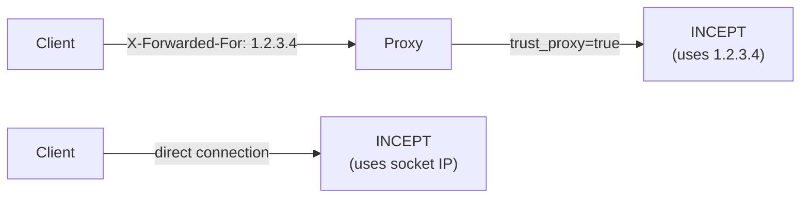
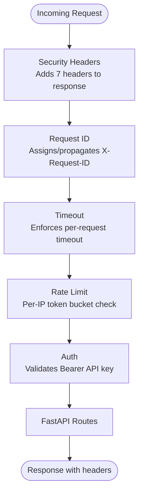

# Security Considerations

INCEPT is designed as an offline, self-hosted tool. This document covers the security measures built into the system.

## Offline-First Design

INCEPT operates entirely offline. The NL-to-command pipeline, intent classification, command compilation, and safety validation all run locally without any network calls. There is no telemetry sent to external services. The only network activity is serving the local API.

## API Key Authentication

When `INCEPT_API_KEY` is set, all API endpoints (except health checks) require a Bearer token in the `Authorization` header:

```
Authorization: Bearer <your-api-key>
```

- Requests without the header or with an incorrect token receive `401 Unauthorized`.
- Health endpoints (`/v1/health`, `/v1/health/ready`) are always publicly accessible for monitoring.
- When `INCEPT_API_KEY` is unset, authentication is disabled entirely.

**Recommendation**: Always set `INCEPT_API_KEY` in production, even if the server is behind a firewall.

## Rate Limiting

A per-client-IP token-bucket rate limiter protects against abuse and accidental request floods:

- Configurable via `INCEPT_RATE_LIMIT` (default: 60 requests/minute).
- **Per-IP isolation**: Each client IP gets an independent token bucket, so one abusive client cannot exhaust limits for other clients.
- Health and metrics endpoints are exempt.
- Exceeding the limit returns `429 Too Many Requests`.
- The bucket refills at a steady rate (limit / 60 tokens per second).
- **Stale bucket cleanup**: Buckets idle for >5 minutes are automatically purged to prevent memory leaks.

### Rate Limit Response Headers

Every response includes:

| Header | Description |
|---|---|
| `X-RateLimit-Remaining` | Tokens remaining in the client's bucket |
| `Retry-After` | Seconds until the next token (only on 429 responses) |

### Proxy Support

When running behind a reverse proxy (nginx, Caddy, Traefik), set `INCEPT_TRUST_PROXY=true` to use the first IP from the `X-Forwarded-For` header as the client IP. **Never enable this when the server is directly exposed to the internet** — clients could spoof their IP.



## Security Headers

Every API response includes the following security headers via the `SecurityHeadersMiddleware`:

| Header | Value | Purpose |
|---|---|---|
| `X-Content-Type-Options` | `nosniff` | Prevents MIME type sniffing |
| `X-Frame-Options` | `DENY` | Prevents clickjacking via iframe embedding |
| `Strict-Transport-Security` | `max-age=63072000; includeSubDomains` | Enforces HTTPS for 2 years |
| `Content-Security-Policy` | `default-src 'none'` | Blocks all content loading (API-only server) |
| `Referrer-Policy` | `strict-origin-when-cross-origin` | Limits referrer leakage |
| `Permissions-Policy` | `geolocation=(), camera=(), microphone=()` | Disables browser features |
| `Cache-Control` | `no-store` | Prevents response caching |

Headers are applied to all endpoints including health checks. Custom response headers set by route handlers are not overwritten.

## Session Limits

The session store enforces a configurable maximum number of concurrent sessions (default: 1000, set via `INCEPT_MAX_SESSIONS`):

- When the limit is reached, expired sessions are cleaned before rejecting.
- If still at limit after cleanup, a `SessionLimitError` is raised.
- Set `INCEPT_MAX_SESSIONS=0` for unlimited sessions.
- Prevents memory exhaustion from unbounded session creation.

## Input Validation

All user input is validated before processing:

- **Null byte rejection**: The `nl` field in `POST /v1/command` rejects strings containing `\x00` bytes, preventing null byte injection attacks.
- **Length limits**: The `nl` field enforces a minimum length of 1 and maximum of 2,000 characters.
- **Type validation**: All request bodies are validated against Pydantic schemas. Invalid payloads return `422 Unprocessable Entity`.
- **Enum enforcement**: The `verbosity` field accepts only `"minimal"`, `"normal"`, or `"detailed"`. The `outcome` field accepts only `"success"` or `"failure"`.

## Telemetry Table Whitelist

The telemetry store validates table names against a whitelist before any SQL operations. Only three table names are permitted: `requests`, `feedback`, `errors`. Any other table name raises `ValueError`, preventing SQL injection via table name interpolation in dynamically constructed queries.

## No Remote Code Execution

INCEPT generates commands but does not execute them by default on the server side. The API returns command strings as data. Execution is an opt-in client-side action:

- The CLI `--exec` flag must be explicitly passed for one-shot execution.
- The `auto_execute` config option defaults to `false`.
- The server API never executes commands.

## Request Timeout Protection

Every request is subject to a configurable timeout (default: 30 seconds). This prevents slow or hung pipeline stages from consuming server resources indefinitely. Timed-out requests return `504 Gateway Timeout`.


- No privileged mode required.
- No special Linux capabilities needed.
- The application user owns only `/app` and its contents.
- Only port 8080 is exposed.

## Request ID Tracing

Every response includes an `X-Request-ID` header for audit logging and request correlation. Clients can supply their own `X-Request-ID` value, which the server propagates unchanged.

## Safety System

The command validation pipeline blocks known-dangerous patterns before they reach the user. See [safety.md](safety.md) for the full list of 22 banned patterns, 5 safe-mode restrictions, and the risk classification system.

## PII Handling

The optional telemetry module strips PII from stored data:

- IP addresses are replaced with `<IP>`
- Email addresses are replaced with `<EMAIL>`
- Home directory paths (`/home/user`, `/Users/user`) are replaced with `<HOME>`
- Usernames in common patterns are replaced with `<USER>`

Telemetry is opt-in (disabled by default) and stored locally in SQLite.

## Middleware Stack

The server middleware is applied in a specific order. The outermost middleware processes requests first and responses last:



## Recommendations for Production

1. **Set `INCEPT_API_KEY`** to a strong, random value.
2. **Place behind a reverse proxy** (nginx, Caddy, Traefik) for TLS termination.
3. **Set `INCEPT_TRUST_PROXY=true`** when behind a reverse proxy for accurate per-IP rate limiting.
4. **Restrict network access** so the API is reachable only from trusted clients.
5. **Set `INCEPT_SAFE_MODE=true`** (the default) to block additional risky patterns.
6. **Set appropriate rate limits** based on expected traffic.
7. **Set `INCEPT_MAX_SESSIONS`** based on expected concurrent users.
8. **Monitor the `/v1/metrics` endpoint** for anomalous request patterns.
10. **Do not mount sensitive host directories** into the container.
